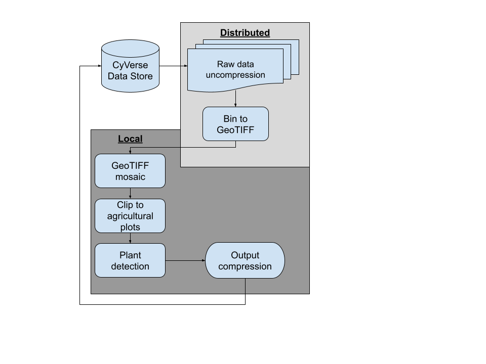

# PhytoOracle's FlirIr Pipeline

## Overview
Welcome to PhytoOracle's FlirIr pipeline! This pipeline uses containers developed by the [PhytoOracle team](https://github.com/phytooracle) to extract thermal data from image files. The pipeline is avaiable for either HPC (High Performance Computing) systems or cloud based systems.

<p align="center">
    
<p>

## Containers
FlirIr uses the following containers for data conversion:

|Order|Container|Process
|:-:|:-:|:-:|
1|[flir2tif](https://github.com/phytooracle/flir_bin_to_tif_s11)|Converts bin compressed files to GeoTIFFs|
2|[stitchplots](https://github.com/phytooracle/flir_field_stitch)|Aggregates multiple GeoTIFFs into a single orthomosaic|
2|[plotclip](https://github.com/phytooracle/rgb_flir_plot_clip_geojson)|Clips GeoTIFFs to the plot|
3|[planttemp](https://github.com/phytooracle/flir_plant_temp)|Extracts individual plant temperatures|

## Data overview
PhytoOracle's FlirIr requires a metadata file (`<metadata>.json`) for every compressed image file (`<image>.bin`). Each folder (one scan) contains one metadata file and one compressed images. 

## Setup Guide
### Running PhytoOracle on Atmosphere VM
- Change directory:
```
cd /scratch/PhytoOracle/FlirIr/
```

- Run the pipeline:
```
./run.sh <date>
```
