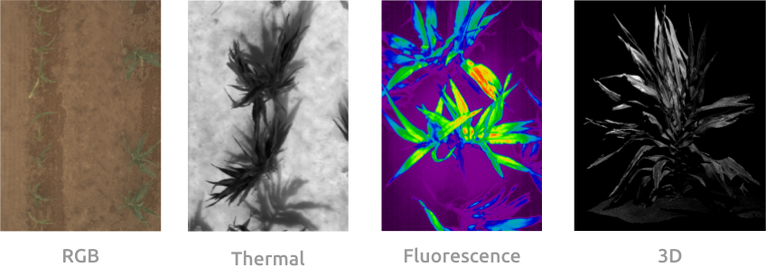
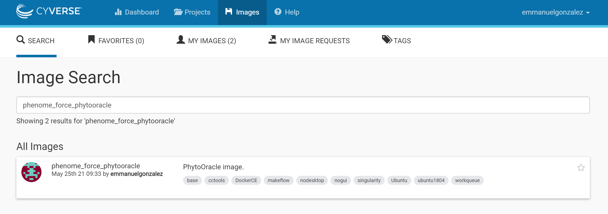
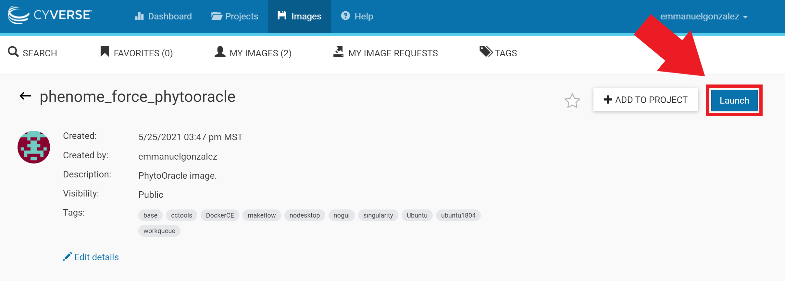
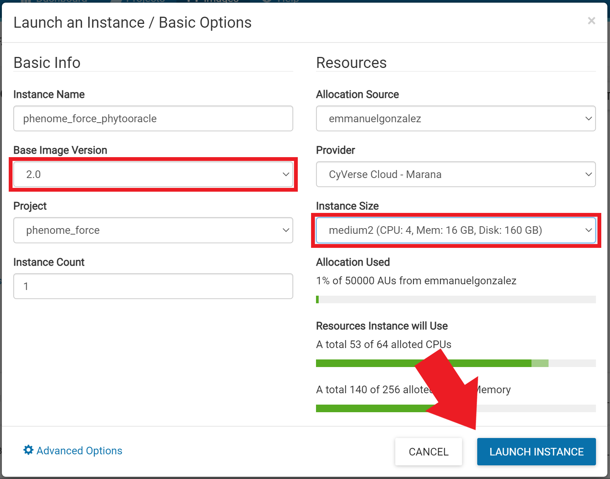
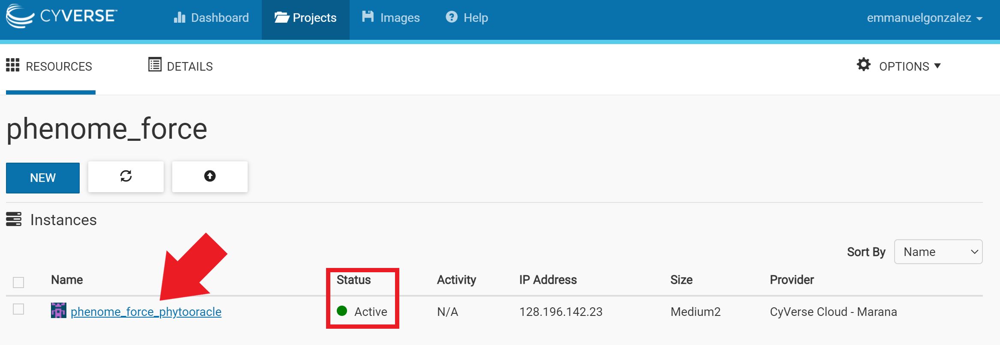
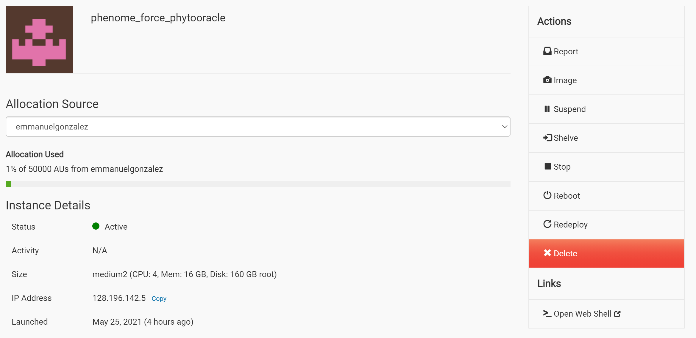
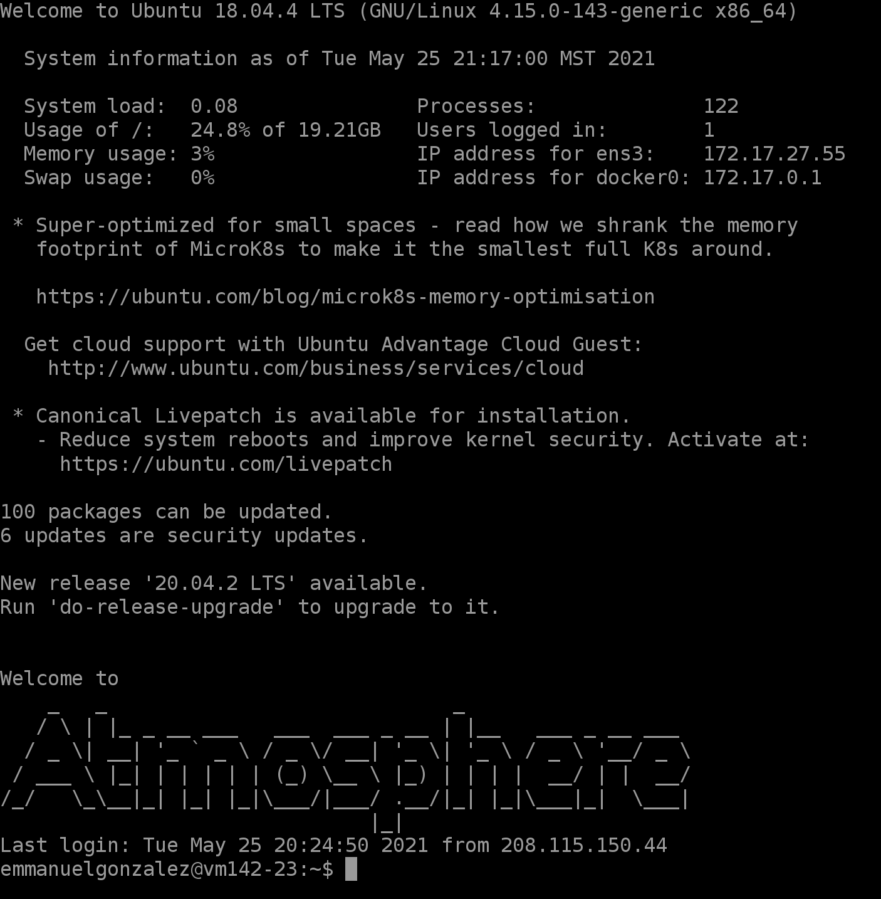

# PhytoOracle

<p align="center">
    
<p>

PhytoOracle is a scalable, distributed workflow manager for analyzing highthroughput phenotyping (phenomic) data. It is designed to process data from the [UArizona Gantry](https://youtu.be/da2gKRdMeXY) but can be adapted to work for data from other platforms such as drones, indoor plant phenotyping platforms, and satellite imagery. 

<p align="center">
    
<p>

PhytoOracle uses the [CCTools](https://cctools.readthedocs.io/en/latest/) master-worker framework for distributed computing (HPC, Cloud, etc.) and can run jobs on nearly all Unix environments. This framework allows thousands of jobs to run in parallel, significantly expediting processing of phenomic data. 

## Workshop preparation
- Create a CyVerse account [here](https://cyverse.org/new%20users).

- Register for the workshop [here](https://user.cyverse.org/workshops/67).

- Search for phenome_force_phytooracle image
<p align="center">
    
<p>

- Launch the node 
<p align="center">
    
<p>

- Specify VM resources
<p align="center">
    
<p>

- Once the VM status is Active, click phenome_force_phytooracle
<p align="center">
    
<p>

- Launch the VM by clicking on Open Web Shell 
<p align="center">
    
<p>

- You will see a window like the one below
<p align="center">
    
<p>

- Change directory
```
cd /opt/
```

- Move contents
```
mv PhytoOracle/ phenome_force_data.simg prepare_pipeline.sh /scratch/
```

- Change directory 
```
cd /scratch/
```

- Download the necessary data 
```
./prepare_pipeline.sh
```

We are now ready to process our phenomic data! 

## Documentation

See our [detailed documentation](https://phytooracle.readthedocs.io) for instruction manuals and examples. 

## Supported Sensors and Pipelines

+ [StereoTopRGB](https://phytooracle.readthedocs.io/en/latest/4_StereoTopRGB_run.html)
+ [FlirIr](https://phytooracle.readthedocs.io/en/latest/5_FlirIr_run.html)
+ [PSII](https://phytooracle.readthedocs.io/en/latest/7_PSII_run.html)
+ [Scanner3DTop](https://phytooracle.readthedocs.io/en/latest/8_3D_run.html)

## Resources

+ [Container code repositories (GitHub)](https://github.com/phytooracle)
+ [Container DockerHub repositories (DockerHub)](https://hub.docker.com/u/phytooracle)

## License 

+ **MIT License**

## Issues and Questions

Need help? Found a bug? Raise an issue on our github page [here](https://github.com/LyonsLab/PhytoOracle/issues).

**For specific workflows and adapting a pipeline for your own work contact:**
+ phytooracle@gmail.com

## Acknowledgements

This project partially built on code initially developed by the [TERRA-REF](https://www.terraref.org/) project and [AgPipeline](https://github.com/AgPipeline/) team. We thank the University of Arizona Advanced Cyberinfrastrcture Concept class of 2019 for additional work.

This material based upon work supported by Cyverse & CCTools. Cyverse is based upon work supported by the National Science Foundation under Grant Numbers: DBI-0735191, DBI-1265383, DBI-1743442. CCTools is based upon work supported by the National Science Foundation under Grant Numbers: CCF-0621434 and CNS-0643229. 
