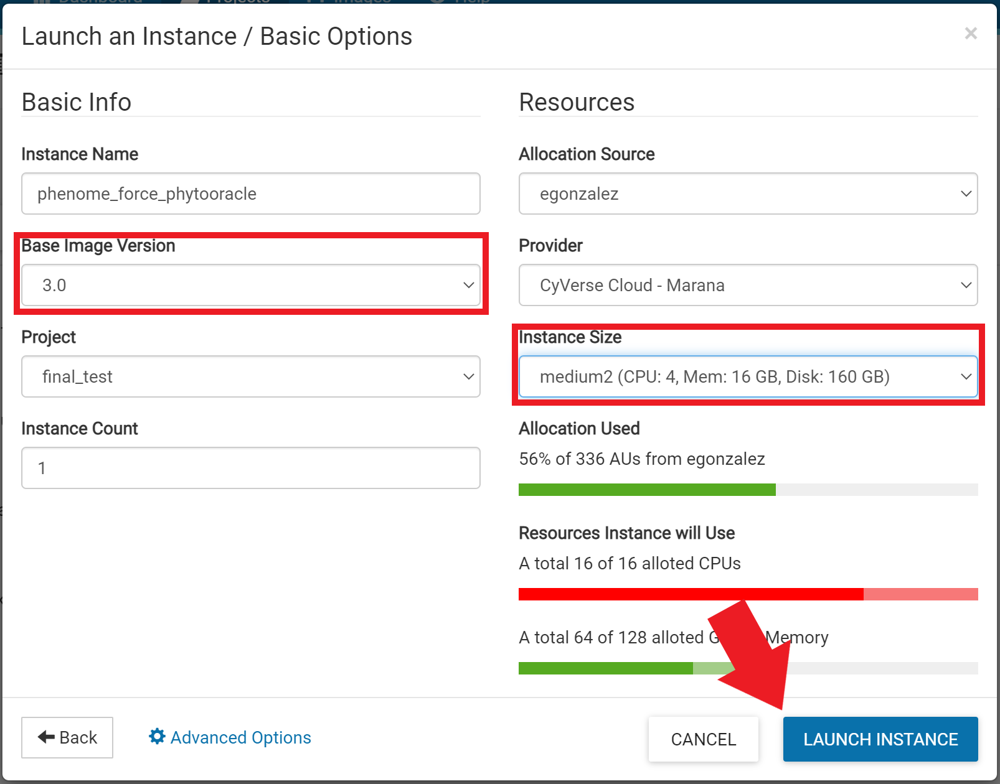
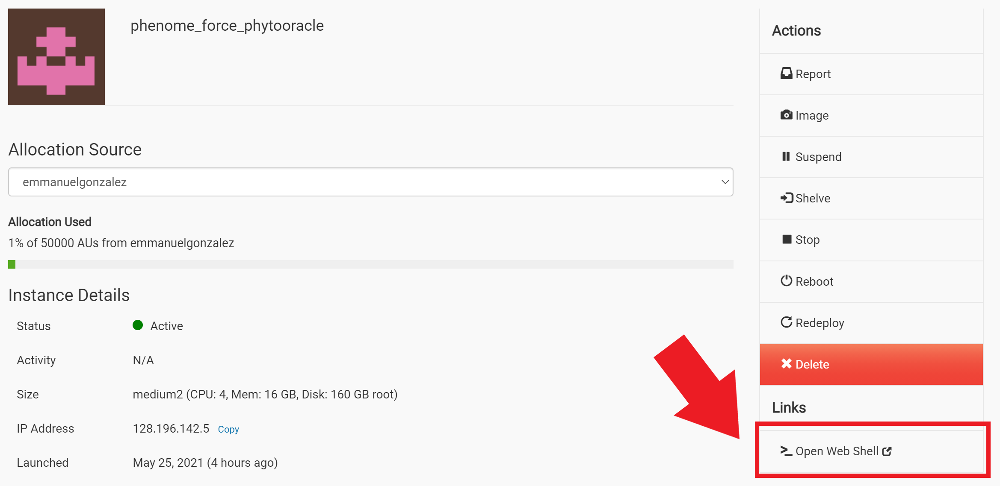

# PhytoOracle

<p>PhytoOracle is a scalable, distributed workflow manager for analyzing high-throughput phenotyping (phenomic) data. It was developed to process data from the [UArizona Gantry](https://youtu.be/da2gKRdMeXY) but can be adapted to process data from other platforms such as drones, indoor plant phenotyping platforms, and satellite imagery. As sensors become cheaper and faster, distributed workflows such as PhytoOracle will be required to extract actionable data from large image datasets to enable research aimed at *connecting phenotypes to genotypes*.</p>

## Pipeline overview
<p align="center">
    
<p>

PhytoOracle uses the [CCTools](https://cctools.readthedocs.io/en/latest/) master-worker framework for distributed computing (HPC, Cloud, etc.) to process RGB (StereoTopRGB), thermal (FlirIr), chlororphyll fluorescence (PSII), and 3D point cloud (Scanner3DTop) datasets. This framework allows thousands of jobs to run in parallel on nearly any Linux environment, significantly expediting processing of phenomic data. 

## Workshop preparation
- Create a CyVerse account [here](https://user.cyverse.org/) by clicking on "Sign Up".

- Register for the workshop [here](https://user.cyverse.org/workshops/67).

- Search for the "phenome_force_phytooracle" image:
<p align="center">
    
<p>

- Launch the virtual machine (VM):
<p align="center">
    
<p>

- Specify VM resources:
<p align="center">
    
<p>

- Once the VM status is "Active", click "phenome_force_phytooracle":
<p align="center">
    
<p>

- Launch the VM by clicking on "Open Web Shell":
<p align="center">
    
<p>

- A terminal window open:
<p align="center">
    
<p>

- Alternatively, you can access the VM on your own terminal by running the following command: 
```
ssh <CyVerse username here>@<IP address> 
```

## Pipeline preparation
- Move workshop contents and change directory 
```
cd /opt/ && mv PhytoOracle/ prepare_pipeline.sh /scratch/ && cd /scratch/
```
    
- Download the necessary data 
```
./prepare_pipeline.sh
```

We are now ready to process our phenomic data! Lets start with [FLIR thermal data](https://github.com/LyonsLab/PhytoOracle/tree/phenome_force/FlirIr).

## Documentation

See our [detailed documentation](https://phytooracle.readthedocs.io) for instruction manuals and examples. 

## Supported Sensors and Pipelines

+ [StereoTopRGB](https://phytooracle.readthedocs.io/en/latest/4_StereoTopRGB_run.html)
+ [FlirIr](https://phytooracle.readthedocs.io/en/latest/5_FlirIr_run.html)
+ [PSII](https://phytooracle.readthedocs.io/en/latest/7_PSII_run.html)
+ [Scanner3DTop](https://phytooracle.readthedocs.io/en/latest/8_3D_run.html)

## Resources

+ [Container code repositories (GitHub)](https://github.com/phytooracle)
+ [Container DockerHub repositories (DockerHub)](https://hub.docker.com/u/phytooracle)

## License 

+ **MIT License**

## Issues and Questions

Need help? Found a bug? Raise an issue on our github page [here](https://github.com/LyonsLab/PhytoOracle/issues).

**For specific workflows and adapting a pipeline for your own work contact:**
+ phytooracle@gmail.com

## Acknowledgements

This project was partially built on code initially developed by the [TERRA-REF](https://www.terraref.org/) project and [AgPipeline](https://github.com/AgPipeline/) team. We thank the University of Arizona Advanced Cyberinfrastrcture Concept class of 2019 for additional work.

This material based upon work supported by Cyverse & CCTools. Cyverse is based upon work supported by the National Science Foundation under Grant Numbers: DBI-0735191, DBI-1265383, DBI-1743442. CCTools is based upon work supported by the National Science Foundation under Grant Numbers: CCF-0621434 and CNS-0643229. 
