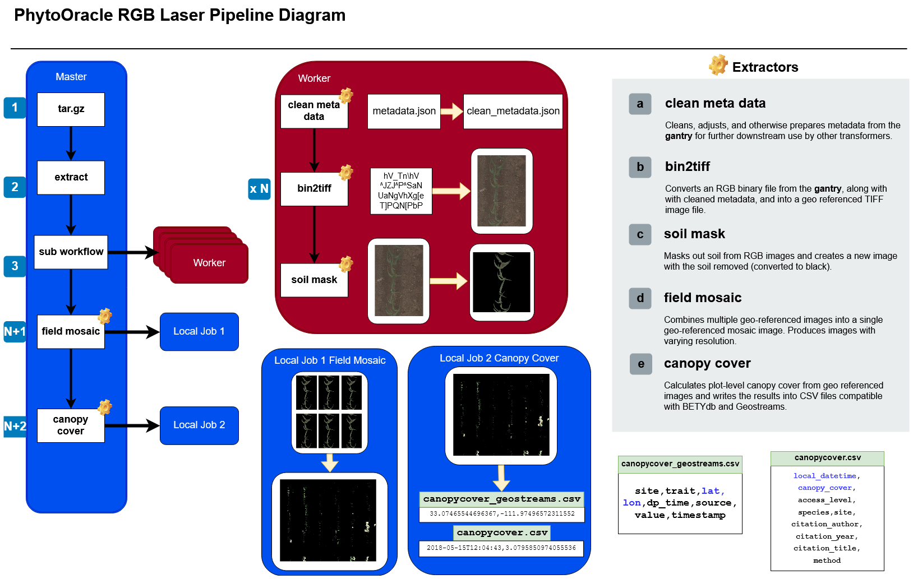

**About Terra-Ref**
-------------------

Modern agriculture has made great progress in reducing hunger and poverty and improving food security and nutrition but still faces tremendous challenges in the coming decades. In order to accelerate plant breeding, we need novel high-throughput phenotyping (HTP) approaches to advance the understanding of genotype-to-phenotype. The Transportation Energy Resources from Renewable Agriculture Phenotyping Reference Platform (TERRA-REF) is one such program that aims to transform plant breeding by using remote sensing to quantify plant traits. The TERRA-REF project provides a data and computation pipeline responsible for collecting, transferring, processing and distributing large volumes of crop sensing and genomic data.

**Gantry Sensors**
------------------

The Lemnatec Scanalyzer Field System is a high-throughput phenotyping field-scanning robot that autonomously moves and continuously collects images of the crops it hovers. Attached to the 30-ton steel gantry of the field-scanning robot are sensors and cameras that collect different sets of data. The diverse array of sensors allow researchers to collect significant sets of data that can be used to leverage biological insight into how environments affect phenotypes and the overall relationship between genotypes (gene) and phenotypes (characteristic). Below are three sensors specific to this project:

  
  **Field Scanning Imaging Sensors**
  
  **INSERT IMAGE HERE**
  
  *Stereo RGB Camers*
  
  	The Stereo RGB camera is a camera that captures images from above which enables researchers to determine canopy cover (spread of plants), the  amount of crops, etc.
	
  *3D Laser Scanner (LIDAR)*
  
  	A 3D scanner that captures the architecture of plants, such as leaf angles and shapes.
	
  *PSII Fluorescence Response Camera*
  
  	A camera that allows researchers to understand how efficient plants are at photosynthesizing.
	

  **Transformer: Metadata Cleaner**
  
	  This transformer is specialized specifically to clean Gantry metadata to allow easier processing by sensor extractors. This requires the transformer to also have its own transformer_class; a transformer instance for special parameter handling.
	  
	  **Parameters**
	  
	  There are two additional parameters for this transformer: *sensor* and *userid*.
	  
	  	- The sensor parameter is required and refers to the metadata it's associated with.
		- The userid parameter is optional and allows additional identification information to be stored with the cleaned metadata.
  
  **Sensor Extractors**
   
   **Stereo 3D RGB Extractors**
   
		**Canopy cover extractor**

			This extractor processes binary stereo images and generates plot-level percentage canopy cover traits for BETYdb.

				**Input**

				- Evaluation is triggered whenever a file is added to a dataset
				- Following data must be found

					- _left.bin image
					- _right.bin image
					- dataset metadata for the left+right capture dataset; can be attached as Clowder metadata or included as a metadata.json file

				**Output**

				- CSV file with canopy coverage traits will be added to original dataset in Clowder
				- The configured BETYdb instance will have canopy coverage traits inserted

		**Full field mosaic stitching extractor**

			This extractor takes a day of stereo BIN files and creates tiled JPG/TIFF images as well as a map HTML page.

				**Input**

				- Currently this should be run on Roger as a job. Date is primary parameter.
				
				

   **3D Scanner Extractors**
  
  		**PLY to LAS conversion extractor**

			This extractor converts PLY 3D point cloud files into LAS files. The LAS file will be placed in the same directory as PLY file.

				**Input**

				- Evaluation is triggered whenever a file is added to a dataset
				- Checks whether the file is a .PLY file

				**Output**

				- The dataset containing the .PLY file will get a corresponding .LAS file

	
**TERRA-REF Pipeline Bottlenecks**
----------------------------------

**Computing:**

- Requires large computation of data
- Each step in the Terra-ref pipeline requires interaction with a database 
- RabbitMQ lacks workflow features
- Complex dependencies

**Development:**

- Monitoring and reprocessing is time intensive
- Difficult to add new algorithms
- Not clear how to reuse and adapt components

**Solution**
------------

Establish a generalized workflow that includes a template extractor, which will enable a lower barrier for contributors and reduce the effort for developers.

**Intro to CC tools**
---------------------

The Cooperating Computing Tools `(CCTools) <http://ccl.cse.nd.edu/software/>`_ help design and deploy scalable applications that run on hundreds or thousands of machines at once. Work Queue within CCTools is a framework for building large master-worker applications that span thousands of machines drawn from clusters, clouds, and grids. 

CCTool's `ReadtheDocs 
<https://www.cctools.readthedocs.io/en/latest/about/>`_

**Concept Maps**
----------------

