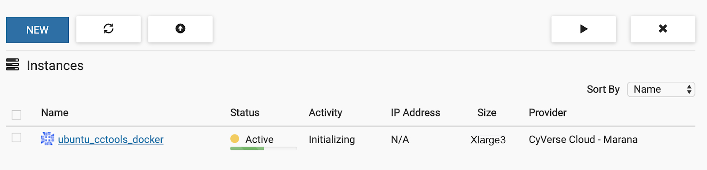
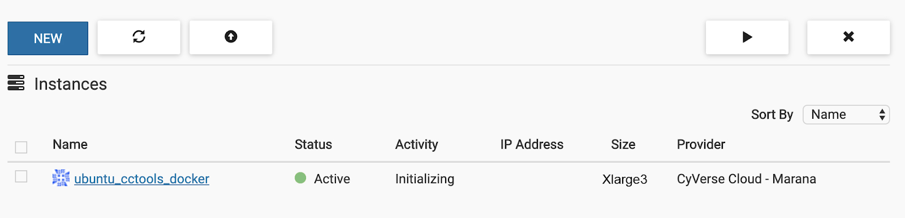
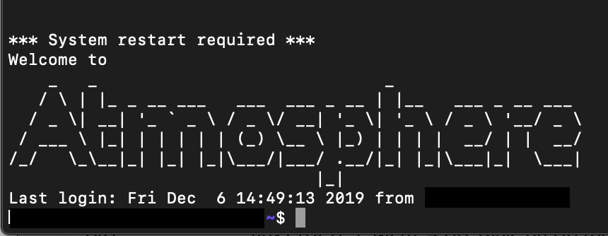

***************************************************
Plug-Play User Manual and Step-by-Step Instructions
***************************************************

*This downloading manual is for users who intend to use the pipeline as-is, with the supporting extractors.*
************************************************************************************************************

Setting up Makeflow using CyVerse Atmosphere
############################################
*Suggested setup instructions for users with little or limited command line experience.*

|

.. topic::  As of cctools 7.0.21 

   the support for the sub-workflow feature in JX is unclear, you need to pull the current master branch from cctools GitHub repo and compile from source.

.. note::  dependency to compile cctools is included if using the following Atmosphere instructions.

|

######################################
**Requirments Prior to Installation:**
######################################
Create a CyVerse Atmosphere account: if not done so already. 

* This may be done here: https://user.cyverse.org/register

.. topic:: If not using CyVerse  Atmosphere:

     the dependency (Ubuntu 18.04 LTS) can be installed from https://jxuzy.blogspot.com/2019/11/install-cctools-ubuntu-1804lts.html

.. note::   You will also need Docker Runtime to run this workflow.

                * Installations instructions may be found here: https://www.digitalocean.com/community/tutorials/how-to-install-and-use-docker-on-ubuntu-16-04

===============================
**Step One: Launch an Image**
===============================

1. Log in to your online CyVerse Atmosphere account.

|

2. Click the "Projects" tab on the header of the webpage. If the project folder is not created already. Click "Create a New Project". Fill in the required fields and click "Create".

|

3. Relocate to this link https://atmo.cyverse.org/application/images/1762 and press the blue "Launch" button to the right of the page. Under the "Project" list, set to your desired project name that you set in the previous step 2. Under the "Instance Size" list, set to "xlarge3(CPU: 16, MEM: 128GB, DISK: 1200GB)". Click "Launch Instance".

|

Launching times may vary. 

Start-up should appear as: 

When finished: 

=========================================
**Step Two: Connecting to your instance**
=========================================
1. Open your computers terminal/PowerShell or to skip these steps click the "ubuntu_cctools_docker" hyperlink you just created, scroll to the bottom of the web page and click ">_Open Web Shell".

2. Login into Atmosphere using the following commands in the terminal. Press "return" after each line.

.. code-block:: RST

  ssh "Your Atmopshere username"@"IP Address" #do not include quotation marks
.. note::   the IP Address is found on your "ubuntu_cctools_docker" instance page - on this page, click copy and paste it as your IP Address.
.. note::   If using a Mac computer with a touch bar and prompted

     .. code-block:: RST

           Are you sure you want to continue connecting (yes/no)?

     type “yes” press return

When asked for your password, use your Atmosphere password. Your password will not show when inputting. You have a limited amount of attempts to put in the password, so prior to this command be sure of what the password is. 

|

The command terminal should appear as the following.

=========================================================
**Step Three: Installing cctools to your Home Directory**
=========================================================
1. The follwoing commands will compile and install cctools to your home directory, makeflow will be at $HOME/cctools/bin/makeflow, which is the path that entrypoint.sh uses.

.. code-block:: RST

  git clone git://github.com/cooperative-computing-lab/cctools.git cctools-github-src
  cd cctools-github-src
  ./configure --prefix $HOME/cctools
  make
  make install

The terminal should automatically begin listing files. 

2. Download test data (tarball), and decompressed it.

In order to complete this next step you must have your iRODs credentials or use the following.

|

+--------------------+-----------------------+-----------------------------+
|For the Prompt      | Enter:                | Comments                    |
+====================+=======================+=============================+
| Host               | data.cyverse.org      |                             |
+--------------------+-----------------------+-----------------------------+
| Port               | 1247                  |if required                  |
+--------------------+-----------------------+-----------------------------+
| User               | your CyVerse username |                             |
+--------------------+-----------------------+-----------------------------+
| Zone               | iplant                |                             |
+--------------------+-----------------------+-----------------------------+
|Default Resource    | leave blank           |it will default automatically|
+--------------------+-----------------------+-----------------------------+

.. note::   If you are not using a CyVerse account or only accessing public data sets.
            
            Set user to **anonymous** -- no password is required

.. code-block:: RST

   iinit 

This should return, if not similar to:

.. code-block:: RST

     One or more fields in your iRODS environment file (irods_environment.json) are

     missing; please enter them.

Enter the credentials: After the password prompt, if anonymous is not being used, it should move to a new line. Type the following:

.. code-block:: RST

    cd starTerra/stereoTop
    iget -K /iplant/home/shared/iplantcollaborative/example_data/starTerra/2018-05-15_5sets.tar
    tar -xvf 2018-5-15_5sets.tar

.. note::   If an Error message presents itself. Type the following:

     .. code-block:: RST

             ils
             pwd
             ls #if 2018-05-15_5sets.tar is red, keep going
             chmod 755 *
             pwd
             tar - xvf /"the output that is given from the previous pwd command. It should be similar to home/username"/2018-05-15_5sets.tar #do not include quotation marks
             git clone https://github.com/uacic/starTerra.git
             mv 2018-05-15 starTerra/stereoTop

..note:: Assuming this step was successful, you should now have the proper files on the machine you are using. You can check to see these files by typing ls starTerra/stereoTop - from there you will be able to see all downloaded information.

     If the output of this solution automatically displays multiple "2018-05-15...."  lines in the terminal, you may proceed. 

.. note:: You may also get the data via other methods, as long as the data is in this directory (starTerra/stereoTop), and follows the same folder structure.

============================================================
**Step Four: Generate the list of files from an iRODS path**
============================================================
To generate the list of input raw data files raw_data_files.jx from an iRODS path. Type the following:

.. code-block:: RST

     python gen_files_list.py 2018-05-15 >  raw_data_files.jx

.. note::  Run the workflow, -r 0 for 0 retry attempts if failed by:

    .. code-block:: RST
         
         chmod 755 entrypoint.sh
         ./entrypoint.sh -r 0 

============================================================
**Step Five: Clean the Data Output and Logs**
============================================================

.. code-block:: RST

    ./entrypoint.sh -c
    rm -f makeflow.jx.args.*

