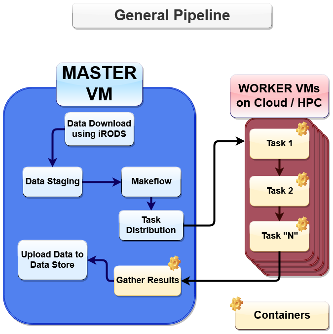
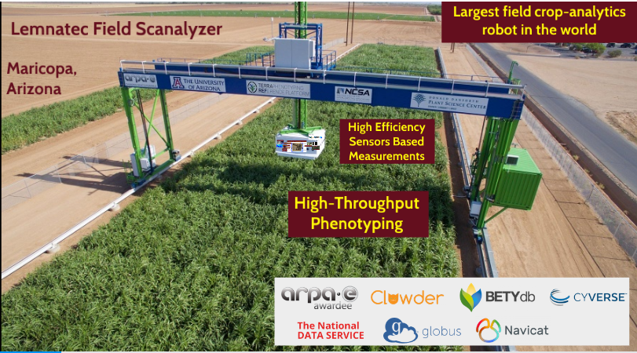
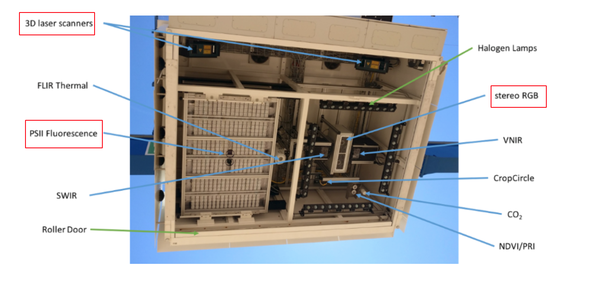

**Overview**

PhytoOracle is a scalable, distributed workflow manager for analyze highthroughput phenotyping data.  It is designed to process data from the UA Gantry (link), but can be adapted to work on data coming from other platforms.  PhytoOracle uses a master-worker framework for distributed computing and can run jobs on nearly all unix-like environment. 

**Supported Sensors**

+ Sensor 1

+ Sensor 2

**Workflows**

**Gantry Sensors**

|gantry_sensors|_

The Lemnatec Scanalyzer Field System is a high-throughput phenotyping field-scanning robot that autonomously moves and continuously collects images of the crops it hovers. Attached to the 30-ton steel gantry of the field-scanning robot are sensors and cameras that collect different sets of data. The diverse array of sensors allow researchers to collect significant sets of data that can be used to leverage biological insight into how environments affect phenotypes and the overall relationship between genotypes (genes) and phenotypes (characteristic). Below are three field scanning imaging sensors:
 
  
**StereoTopRGB**
  
  	The Stereo RGB camera captures images from above which enables researchers to determine the canopy cover (spread of plants)of each plant, the  amount of crops, etc.
	
**Scanner3DTop**
  
  	A 3D scanner that captures the architecture of plants, such as leaf angles and shapes.
	
**PSII**
  
  	A camera that measures the plant's photosynthetic activity.
	
**FlirIr**
  
  	A camera that captures the thermal difference beteween plants.

**Hyperspectral**
  
  	A camera that collects and processes information from across the electromagnetic spectrum.
	
**TERRA-REF Data Volume**

- The gantry system outputs 1 TB of data per day from various sensors. For individual sensor data types and sizes for a day see Data Types & Descriptions `here <https://phytooracle.readthedocs.io/en/latest/Input_data.html>`_

	
**Need for data analysis workflows**

- Existing cyber-infrastructure for the TERRA-REF platform lacks workflow features and has complex dependencies which make it difficult to distribute compute across compute platforms.
- More and more researchers are planning studies of various diverse plant phenotypes using the TERRA-REF platform hence, the need for data-analysis workflows that are reporoducible and easy to deploy.

**PhytoOracle**
---------------

PhytoOracle is a scalable, modular data pipeline for phenomics research. It uses `CCTools <http://ccl.cse.nd.edu/>`_ `Makeflow <http://ccl.cse.nd.edu/software/makeflow/>`_ workflow system for executing large complex workflows on clusters, clouds, and grids. PhytoOracle aims to significantly reduce data-processing times while providing reliable workflows for easy deployment.

**PhytoOracle Solution:**
	- Modular - uses containers for easy deployment and workflow-redesigns.
	- Scalable - uses distributed-computing where possible to reduce processing times.
	- Customizable - uses JX workflow language that allows for custom workflow designs.
	- Fault tolerant - Makeflow is highly fault tolerant: it can crash or be killed, and upon resuming, will reconnect to running jobs and continue where it left off.
	- Leverages open-source solutions.

|general_concept_map|_

About TERRA-REF
---------------

The original code for PhytoOracle is based on work from the TERRA-REF `project <https://terraref.org/>`_.

----

.. _general_concept_map: 

.. _gantry: 

.. _gantry_sensors: 
