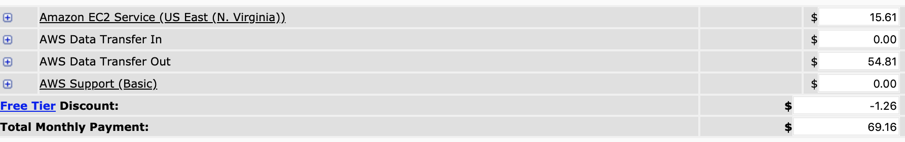
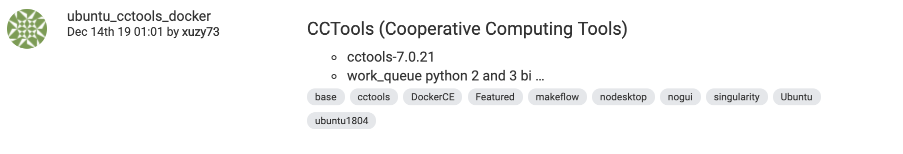
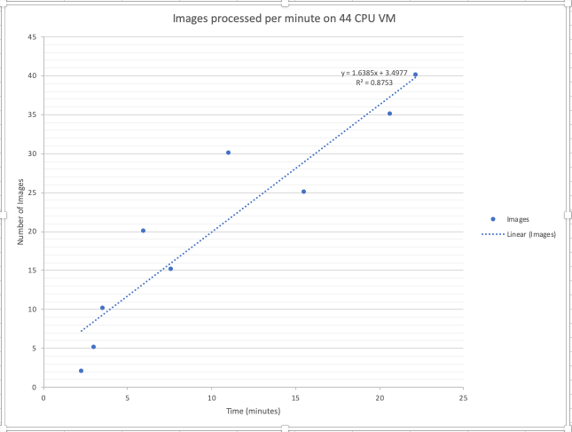
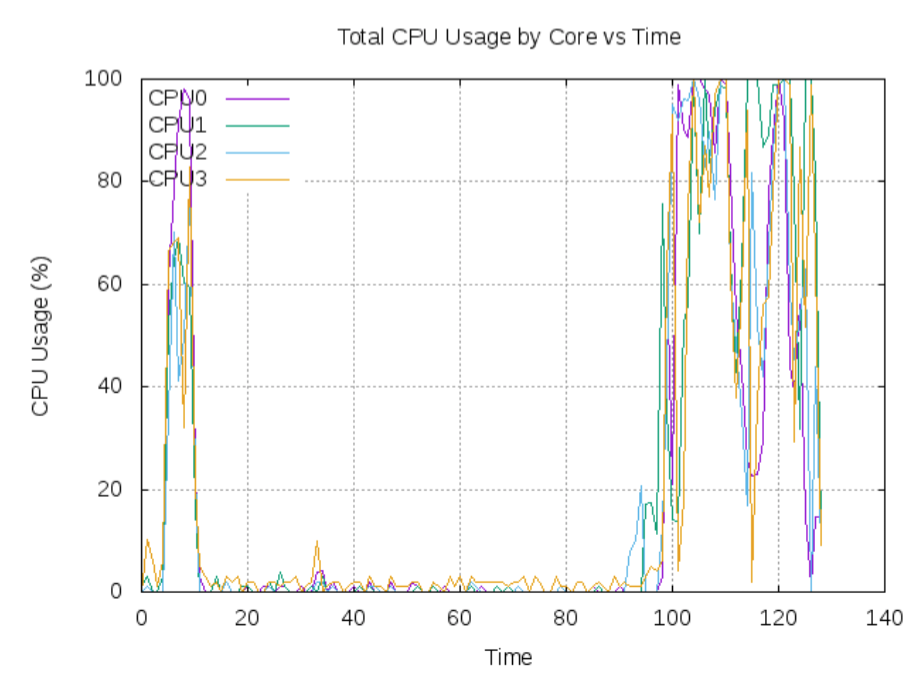
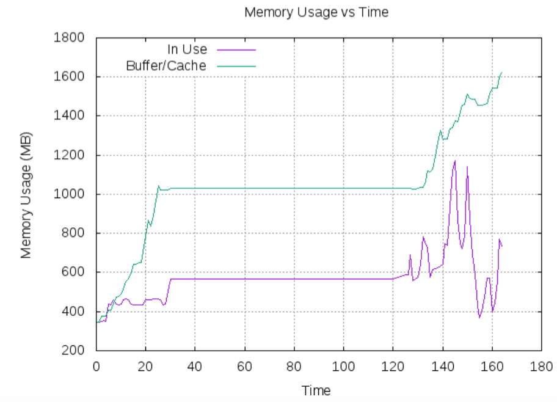

Technical User Manual
=====================

Benchmark Results
-----------------

.. list-table:: StereoRGB Benchmark Results
   :widths: 25 25 50
   :header-rows: 1

   * - Task
     - Description
     - Info
   * - Time to stage data
     - 30 minutes
     - 110 GB compressed file
   * - Running time
     - 4 hours 44 minutes
     - 9355 datasets
   * - Phase-I
     - 1 hours 4 minutes
     - 10 datasets/bundle
   * - Phase-II
     - 3 hours 41 minutes
     - Local run, 1 core on 16 core machine
   * - Average tasks/minute
     - 10.25
     - 
   * - # Workers
     - 108
     - Atmosphere (3x16CPU)
   * - 
     - 
     - Jetstream (1x44CPU)
   * - 
     - 
     - UA-HPC (1x16CPU)
   * - Time to upload data
     - 3 minutes
     - 24 GB compressed file

Amazon Web Service Cost Estimate
--------------------------------

Size:

* Steretop Raw Data input: 110 G / Day

* Steretop Raw Data output: 20 G / Day
     

  
* Steretop Raw Data input: 140 G / Day
     

Integrating New Algorithms
--------------------------

Read `this <https://github.com/AgPipeline/template-rgb-plot/blob/master/HOW_TO.md>`_ document on how to use transformer templates for your custom algorithm. 

Integrating new extractors
--------------------------
The Makeflow file allows for easy integration of new extractors.

Preliminary Benchmark Results:
------------------------------

+ How long it took to run the full dataset: 15:40:11
+ Software installation: CCTools, Singularity
+ Time to Stage Data: < 1hr for 9360 folders
+ Average Tasks/minute: 10.25 
+ # Worker Factories connected: 4 xxlarge Jetstream VMs (CPU: 44, MEM: 128GB, Disk: 480GB)
+ Results deposition: Results transferred to CyVerse Data Store using iRODS

Test: 9,355 datasets (pair of left and right images)
~~~~~~~~~~~~~~~~~~~~~~~~~~~~~~~~~~~~~~~~~~~~~~~~~~~
+ *Phase 1*

  * Clean_metadata: left bin and right bin for each set (38 Mb) 
  * bin2tif: takes both left and right bins and converts them to tif (x2) 
  * soil_mask takes tif images (20 GB)
  
     - Average 50 workers : 3 hours 8 minutes (without bundling)
     - Average 100 workers : 1 hr 4 min (bundling, 10 datasets/bundle)
|
+ *Phase 2*

  * Field_mosaic: takes in all tif images 
  * Canopy cover: takes in resulting field mosaic
  
     - Local run, 1 core on 16 core machine
     - Processing time: 3 hour 41 minutes
|
Stereotop Benchmarking Workflow Process
-------------------------------
* Launch the CCTools (7.0.21) image, like this one.

* Setup

.. code::
   
   sudo apt-get update #update references to packages to install latest
   sudo apt-get upgrade -y #update all currently installed packages
   sudo apt-get install -y sysstat git ruby ruby-dev wget python-dev swig zlib1g-dev build-essential perl libperl-dev singularity-  container #Install all required dependencies for cctool and what we need

* Download data

.. code::

   iinit    # initialize irods with your account 
   
   "irods_host": "data.cyverse.org",
   "irods_port": 1247,
   "irods_user_name": "username",
   "irods_zone_name": "iplant"

* Stage data

.. code::

   sudo mkdir /Data #make dir for the data
   sudo chown username /Data #Makes your user own directory 
   irsync -vs i:/iplant/home/raptorslab/stereoTop.tar.gz /Data/stereoTop.tar.gz ##sync data from cyverse to local machine 
   cd /Data
   tar xvzf stereoTop.tar.gz  #extract directory should have stereotop.tar.gz and dir 2018-05-18
   chown -R username 2018-05-15 # Makes your user own directory 
   chmod -R 775 /Data # Change permissions
   (rm -f stereoTop.tar.gz)   # maybe if you want #optional remove tarball to save time don’t need to run this

* Install cctools

.. code::

   git clone git://github.com/cooperative-computing-lab/cctools.git cctools-github-src
   cd cctools-github-src #get latest cctools from github
   ./configure --prefix /opt/cctools #if no errors, you're good
   make 
   sudo make install (copies binaries to desired location)
   sudo cp /opt/cctools/bin/* /usr/local/bin/ (copy binaries to desired location, make sure this works)

* Run Workqueue
.. code::
   
   nohup bash checkFinal.bsh & #will run workqueue (can now close your laptop)
   old? (nohup work_queue_factory 129.114.104.40 9123 -t 9999999 --cores=1 -w 45 &)

* Killing workqueue processes (after it’s run) ##

.. code::

   pkill work_queue_factory
   ps ax | grep work
   kill -9 (pids from previous command)

* Benchmark Script

https://ua-acic.slack.com/files/UMS6Z7FEC/FR4U0FVNX/checkfinal.bsh

This creates 3 output files that we can aggregate and use GNUplot to display in the final presentation.

* MVP

Benchmark each extractor individually

* Launch cctools image (as large as possible 44core last one) on jetstream (or atmosphere?)
https://github.com/uacic/starTerra/tree/master/stereoTop
https://jxuzy.blogspot.com/2019/11/install-cctools-ubuntu-1804lts.html

Running Benchmarks:
-------------------------------

* Run this in /opt/src/starTerra-php-template/stereoTop
* Assume you have the setup Tanner lead up through dec 11th.
* Makes the raw data files with number given for example here (2)
python gen_files_list.py 2018-05-15/ 2 > raw_data_files.json

* remove the , at the end of the raw_data_files.json file
.. code::
   php main_wf.php > main_wf.jx
   jx2json main_wf.jx > main_workflow.json
   nohup bash entrypoint.bsh -r 0 &

* Save the following output files: 

+ sysUsage.txt
+ cpuUsage.txt
+ memUsage.txt
+ nohup.out

* clears the old stuff
.. code::
   bash entrypoint.bsh -c
   rm nohup.out

* Run these tests upto 40

Benchmarking Results
-------------------------------

* This is the final result of Benchmarking

  

  

Stereotop:
-------------------------------

PhytoOracle is designed for distributed scaling on Cloud platforms and High-Performance Computers. The minimum requirements being:

One Master instance with the required data staged that will broadcast jobs
One or more instances that will launch Worker_Factories that will connect to the Master
Required Software

* CCTools 7.0.21

* Singularity

* iRODS Client

CyVerse Atmosphere Image
*Using Atmosphere image that comes with recommended CCTools (7.0.21) and Singularity (7.0.21) version installed.

CCTools (7.0.21)

* You can install the dependency for compile from source (Ubuntu 18.04 LTS) here:

* These commands will compile and install cctools (version 7.0.21) to /usr/bin, so that they are in the $PATH.

.. code::

   wget http://ccl.cse.nd.edu/software/files/cctools-7.0.21-source.tar.gz
   tar -xvf cctools-7.0.21-source.tar.gz
   cd cctools-release-7.0.21
   ./configure --prefix /usr
   make -j$(nproc)
	sudo make install

Singularity 3.5.1 (recommended)

* Install dependencies for singularity

.. code::

	sudo apt-get update && sudo apt-get install -y \
	build-essential \
	libssl-dev \
	uuid-dev \
	libgpgme11-dev \
	squashfs-tools \
	libseccomp-dev \
	wget \
	pkg-config \
	git \
	cryptsetup
	wget https://dl.google.com/go/go1.13.5.linux-amd64.tar.gz
	sudo tar -C /usr/local -xzf go1.13.5.linux-amd64.tar.gz
	echo "export PATH=\$PATH:/usr/local/go/bin" | sudo tee -a /etc/profile
	export PATH=$PATH:/usr/local/go/bin

* Build singularity

.. code::

	wget https://github.com/sylabs/singularity/releases/download/v3.5.1/singularity-3.5.1.tar.gz
	tar -xvf singularity-3.5.1.tar.gz
	cd singularity
	./mconfig && \
	make -C builddir && \
	sudo make -C builddir install
    
Staging Data on Master Instance
-------------------------------
* Git Clone the PhytoOracle github repository.

.. code::

	git clone https://github.com/uacic/PhytoOracle
	cd PhytoOracle
	git checkout dev

* Download test data (tarball), and decompress it

Enter your iRODS credentials

.. code::

	iinit
	
* Then

.. code::

	cd stereoTop
	iget -K /iplant/home/shared/iplantcollaborative/example_data/starTerra/2018-05-15_5sets.tar
	tar -xvf 2018-05-15_5sets.tar

Note: you can also get the data via other methods, as along as the data is in this directory (PhytoOracle/stereoTop), and follows the same folder structure.

* Hosting data on a HTTP Server (Nginx)
.. code::

	sudo apt-get install nginx apache2-utils
	wget https://raw.githubusercontent.com/uacic/PhytoOracle/dev/phyto_oracle.conf
	sudo mv phyto_oracle.conf /etc/nginx/sites-available/phyto_oracle.conf
	sudo ln -s /etc/nginx/sites-available/phyto_oracle.conf /etc/nginx/sites-enabled/phyto_oracle.conf
	sudo rm /etc/nginx/sites-enabled/default
	sudo nginx -s reload

* Set username and password for the HTTP file server
Set password

.. code::

	sudo htpasswd -c /etc/apache2/.htpasswd YOUR_USERNAME

* In the file /etc/nginx/sites-available/phyto_oracle.conf, change the line (~line 21) to the destination path to where the data is to be decompressed, e.g. /home/uacic/PhytoOracle/stereoTop
.. code::

	root /scratch/www;
	
* Change permissions of the data to allow serving by the HTTP server

.. code::

	sudo chmod -R +r 2018-05-15/
	sudo chmod +x 2018-05-15/*
	
* Change URL inside main_wf.php (~line 30) to the IP address or URL of the Master VM instance with HTTP server
* URL needs to have slash at the end

.. code::

	$DATA_BASE_URL = "http://vm142-80.cyverse.org/";
	
* Change username and password inside process_one_set.sh (~line 27) to the ones that you set above

.. code::

	HTTP_USER="YOUR_USERNAME"
	HTTP_PASSWORD="PhytoOracle"

Generating workflow json on Master

* Generate a list of the input raw-data files raw_data_files.jx from a local path as below

.. code::

	python3 gen_files_list.py 2018-05-15/ >  raw_data_files.json
	
* Generate a json workflow using the main_wf.php script. The main_wf.php scripts parses the raw_data_files.json file created above.

.. code::

	sudo apt-get install php-cli
	php main_wf_phase1.php > main_wf_phase1.jx
	jx2json main_wf_phase1.jx > main_workflow_phase1.json
	
* Run the workflow on Master

.. code::

	-r 0 for 0 retry attempts if failed (it is for testing purposes only).
	chmod 755 entrypoint.sh
	./entrypoint.sh -r 0
	
* At this point, the Master will broadcast jobs on a catalog server and wait for Workers to connect. Note the IP ADDRESS of the VM and the PORT number on which makeflow is listening, mostly 9123. We will need it to tell the workers where to find our Master.

Connecting Worker Factories to Master

* Launch one or more large instances with CCTools and Singularity installed as instructed above.

* Connect a Worker Factory using the command as below

.. code::

	work_queue_factory -T local IP_ADDRESS 9123 -w 40 -W 44 --workers-per-cycle 10  -E "-b 20 --wall-time=3600" --cores=1 --memory=2000 --disk 10000 -dall -t 900

argument	description
-T local	this species the mode of execution for the factory
-w	min number of workers
-W	max number of workers
Once the workers are spawned from the factories,you will see message as below

.. code::

	connected to master
* Makeflow Monitor on your Master VM

.. code::

	makeflow_monitor main_wf_phase1.jx.makeflowlog
	
* Work_Queue Status to see how many workers are currently connected to the Master

.. code::

	work_queue_status
	
* Makeflow Clean up output and logs

.. code::

	./entrypoint.sh -c
	rm -f makeflow.jx.args.*

Connect Workers from HPC
-------------------------------
* Here is a pbs script to connect worker factories from UArizona HPC. Modify the following to add the IP_ADDRESS of your Master VM.

.. code::

	#!/bin/bash
	#PBS -W group_list=ericlyons
	#PBS -q windfall
	#PBS -l select=2:ncpus=6:mem=24gb
	#PBS -l place=pack:shared
	#PBS -l walltime=02:00:00
	#PBS -l cput=02:00:00
	module load unsupported
	module load ferng/glibc
	module load singularity
	export CCTOOLS_HOME=/home/u15/sateeshp/cctools
	export PATH=${CCTOOLS_HOME}/bin:$PATH
	cd /home/u15/sateeshp/
	/home/u15/sateeshp/cctools/bin/work_queue_factory -T local IP_ADDRESS 9123 -w 80 -W 200 --workers-per-cycle 10  -E 

Scanner3DTop:
**TODO decide if and how we are attempting to benchmark this one. 

     
     

