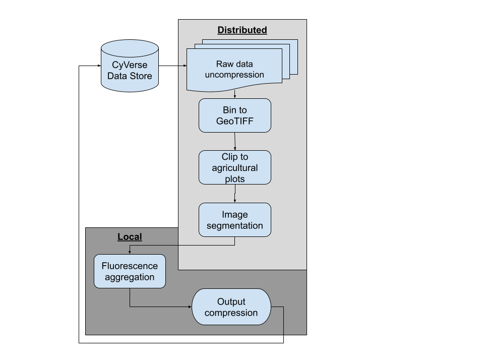

# PhytoOracle's PSII Pipeline

## Overview
Welcome to PhytoOracle's PSII chlorophyll fluorescence pipeline! This pipeline uses the data transformers from the [PhytoOracle team](https://github.com/phytooracle) to extract chlorophyll fluorescence data. The pipeline is avaiable for either HPC (High Performance Computing) systems or cloud based systems.

<p align="center">
    
<p>

## Transformers used
PSII currently uses the following transformers for data processing:

|Order|Transformer|Process
|:-:|:-:|:-:|
1|[bin2tif](https://github.com/phytooracle/psii_bin_to_tif)|Converts bin files to GeoTIFFs|
2|[plotclip](https://github.com/phytooracle/rgb_flir_plot_clip_geojson)|Clips GeoTIFFs to agricultural plot boundaries|
3|[fluorescence segmentation](https://github.com/phytooracle/psii_segmentation)|Segments pixels given a validated set of thresholds|
4|[fluorescence aggregation](https://github.com/phytooracle/psii_fluorescence_aggregation)|Aggregates segmentation data for each image and calculates F0, Fm, Fv, and Fv/Fm|

## Data overview
PhytoOracle's psII pipeline requires a metadata file (`<metadata>.json`) for every compressed image file (`<image>.bin`). Each folder (one scan) contains one metadata file and 102 compressed images. 

## Setup Guide
### Running PhytoOracle on Atmosphere VM
- Change directory to psII:
```
cd ~/PhytoOracle/psII/
```

- Open a new terminal window and run:
```
./worker_scripts/po_worker.sh
```

- Run the pipeline:
```
./run.sh <date>
```
